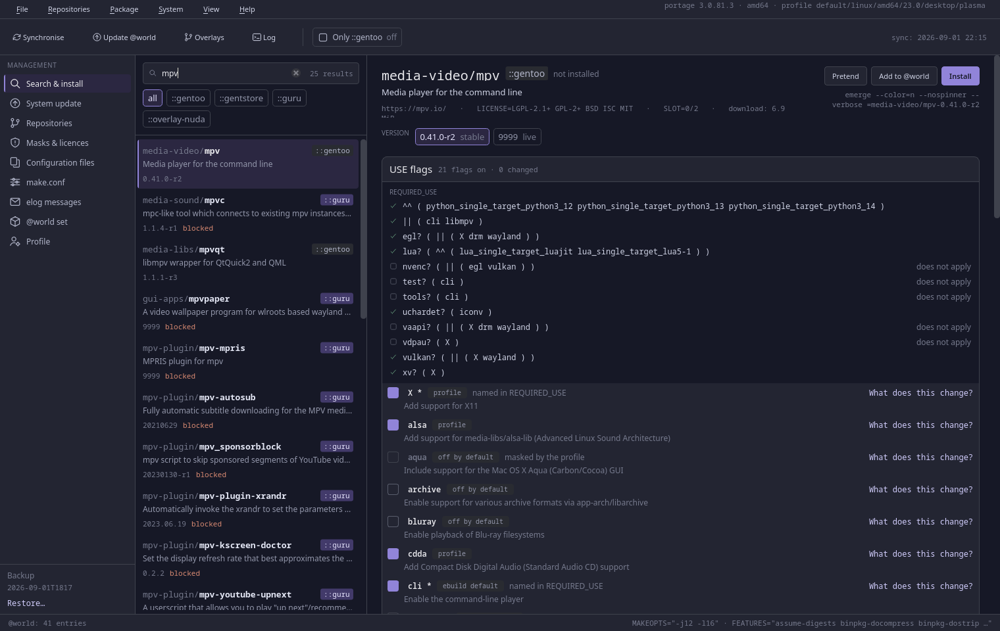
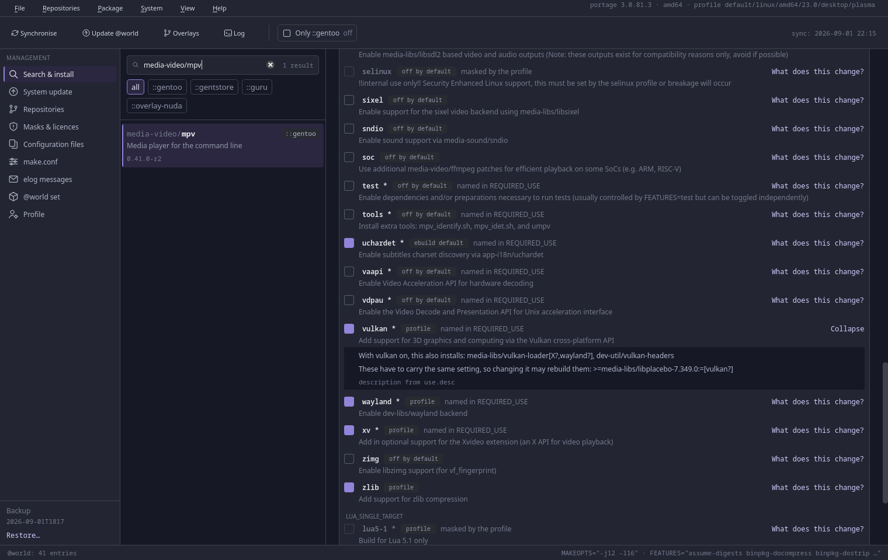
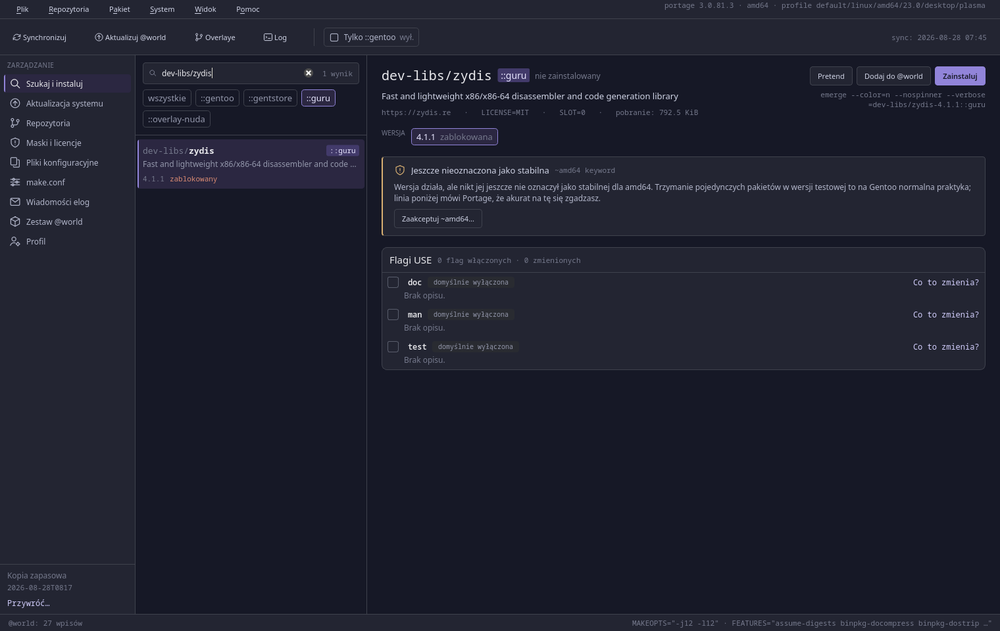
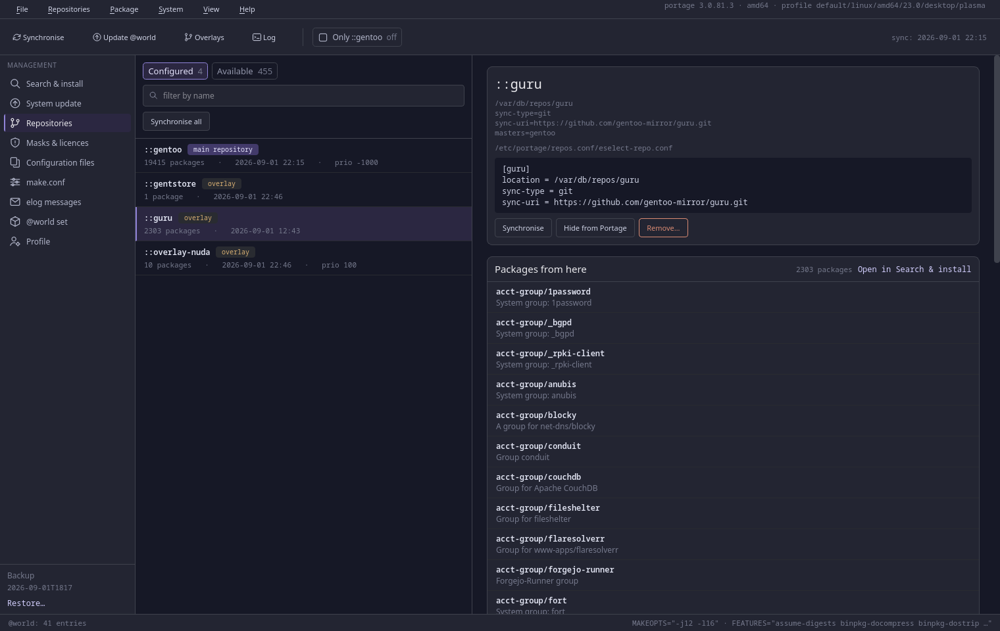
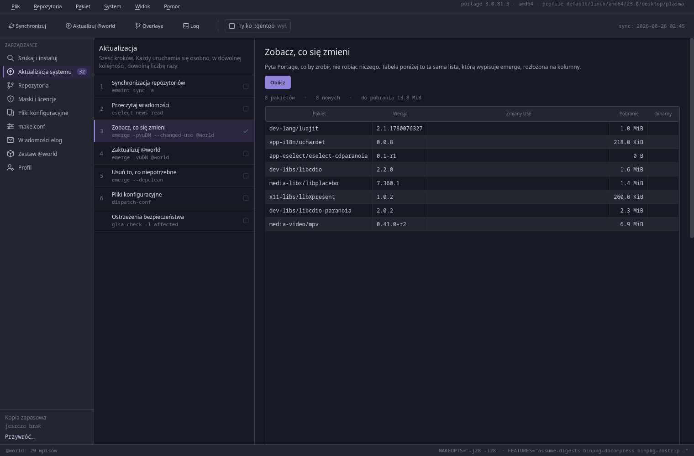
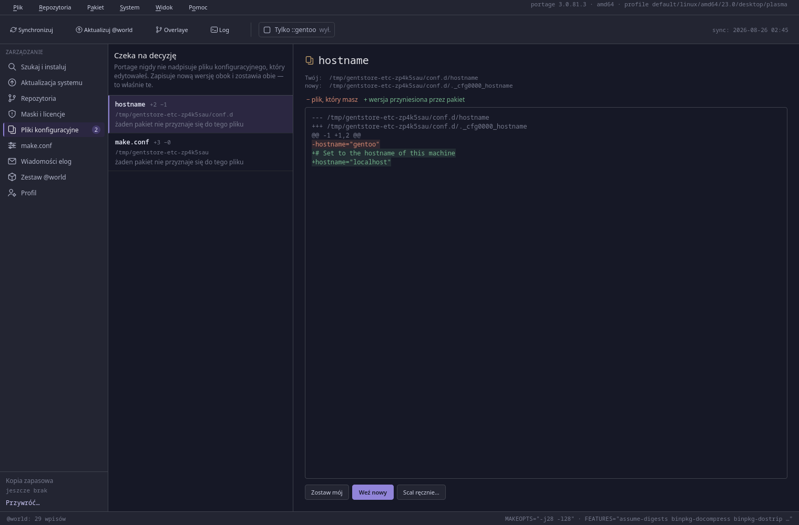

# Gentstore

A graphical front-end for Portage on Gentoo Linux — searching for and installing packages, USE
flags with an explanation of what each one does, masks and licences, overlays, and the full
system update cycle.

Written in Python 3 with PyQt6. Bilingual: **Polish and English**.

> **Version 1.0.0.** All nine screens work, and both halves have been exercised on a live
> system: the read-only side — search, USE flags, masks, repositories, the update preview,
> configuration files, `make.conf`, elog and `@world` — and the privileged one, which has
> written real `package.use`, `package.license` and `package.accept_keywords` entries through
> `pkexec` and run `emerge`, `emaint sync` and `eselect` through the launcher. 514 tests pass.
>
> What that number does not claim: this has run on **one** machine, amd64 only, so the ebuild
> is keyworded `~amd64`. Bug reports from other setups are the fastest way to make the next
> release better.

## What it looks like

| | |
|---|---|
|  |  |
| **Search and install** — results from four repositories, package details, versions with their keywords | **USE flags** — where each flag's value comes from, and exactly what turning it on changes |
|  |  |
| **One repository at a time** — the same package lives in `::gentoo` and in `::guru`; the badge you pick decides which one the install comes from | **Repositories** — the `repos.conf` section verbatim, and the catalogue of 459 overlays |
|  |  |
| **System update** — six steps, with a preview table built from the output of `emerge -pv` | **`._cfg` files** — the difference, and three answers |

*(The pictures were taken with the interface in Polish. `python tools/readme_shots.py` retakes
them; it now defaults to English.)*

## The principles this application stands on

- **Nothing happens quietly.** Every change to `/etc/portage` is previewed before it is
  written, and afterwards the application shows the exact path of the file and the exact line
  it added.
- **We never overwrite the user's files.** We append lines, or change one specific line;
  comments and the formatting of the rest of the file are left untouched.
- **The graphical process is not root.** Everything that needs privileges goes through
  `pkexec` and a small, reviewable helper program.
- **The data comes from the `portage` API**, not from parsing ebuilds.
- **The chosen repository applies everywhere.** Clicking a `::repo` badge — or typing
  `name::repo` into the search box — narrows not only the list but also the detail panel, the
  versions, and the atom `emerge` is given. The same package in two overlays no longer blurs
  together, and no longer depends on repository priority.

## Requirements

| Package | Role |
|---|---|
| `dev-lang/python` ≥ 3.12 | the runtime |
| `sys-apps/portage` | the `portage` module — package data |
| `dev-python/pyqt6` | the graphical interface (the default USE flags are enough) |
| `dev-qt/qttools[linguist]` | `lrelease` — compiling the translations |
| `app-eselect/eselect-repository` | overlay management and the `repositories.xml` catalogue |
| `sys-auth/polkit` | `pkexec` — raising privileges |

Optional: `app-portage/gentoolkit` (GLSA scanning) and `app-portage/cpuid2cpuflags` (the
`CPU_FLAGS_X86` suggestion). Their absence disables a single feature and is reported in the
interface — it does not bring the application down.

## Installation

Two routes. The choice comes down to whether Portage should know about Gentstore.

### Through Portage — a local overlay

No clone needed. Fetch the overlay script, read it, run it:

```bash
curl -fsSL -O https://raw.githubusercontent.com/JamJan05/GentStore/main/packaging/make-overlay.sh
less make-overlay.sh          # 200 lines, and it is about to run as root
sudo bash make-overlay.sh

emerge --ask app-portage/gentstore
```

Reading it first is the version this project recommends, and not out of ceremony: the whole
application is built on the idea that nothing touching root should happen unread. If you would
rather have the one-liner anyway, it is the same script:

```bash
curl -fsSL https://raw.githubusercontent.com/JamJan05/GentStore/main/packaging/make-overlay.sh | sudo bash
```

Either way, run `emerge --ask app-portage/gentstore` afterwards — the script deliberately stops
short of installing anything and prints the command instead.

From a clone it works exactly the same, and that is the form to use when you are changing the
code:

```bash
git clone https://github.com/JamJan05/GentStore.git
cd GentStore
sudo packaging/make-overlay.sh          # or: sudo make overlay
```

The script registers `/var/db/repos/gentstore` as a **synced** overlay: Portage clones the
`overlay` branch, so later ebuilds arrive with an ordinary `emerge --sync` and you never come
back here. It prints every file it writes and overwrites nobody else's. You run `emerge`
yourself — the script only prints the command.

### Which version you get

**The tagged release**, unless you say otherwise. Run on a terminal, the installer asks:

```
Which one should Portage install?

  1) 1.0.0 — the release. Tagged, and replaced by the next one on an
     ordinary "emerge --sync && emerge --update @world". Recommended.
  2) 9999 — the live ebuild. Rebuilt from the newest commit whenever you
     run "emerge @live-rebuild". Newer, and occasionally broken.

  [1/2, blank for 1]:
```

With no terminal to ask on — a pipe on both ends, a CI job — it takes the release and says so.
`--stable` and `--live` skip the question outright.

This is not just which command gets printed: `9999` sorts above every release there will ever
be, so if the live ebuild were accepted in `package.accept_keywords`, a plain
`emerge app-portage/gentstore` would resolve to the git tip for everybody. Choosing the release
means the live ebuild is deliberately left unaccepted.

Afterwards a release install updates like any other package:

```bash
emerge --ask --sync                         # or the Sync step inside Gentstore
emerge --ask --update @world
```

A live install has a version number that never changes, so `--update` has nothing to notice.
Rebuilding it from the newest commit is a set of Portage's own, covering every live package you
have:

```bash
emerge --ask @live-rebuild
```

That rebuilds unconditionally. `app-portage/smart-live-rebuild` checks upstream first and
rebuilds only what actually moved, which is worth having if you run more than one live package.

Other options: `--no-sync` pins a copy of the ebuild that never changes under you,
`GENTSTORE_REF=<branch-or-tag>` fetches the script's own sources from elsewhere, and
`--local` builds from a working tree.

Either way `gentstore` is an ordinary package from here on: it is in `@world`, it shows up in
`qlist`, and it goes away with `emerge --deselect --unmerge app-portage/gentstore`. Both ebuilds
build from GitHub rather than from your working directory; `--local` points the live one at a
clone instead, which is the thing to use when you are testing a change before pushing it. The
details are in [`packaging/`](packaging/README.md).

To take the overlay back out: `sudo bash make-overlay.sh --remove` (or, without the file,
`curl -fsSL <the URL above> | sudo bash -s -- --remove`).

### From the working directory — for working on the code

```bash
emerge --ask dev-python/pyqt6 dev-qt/qttools app-eselect/eselect-repository sys-auth/polkit

python tools/i18n.py compile   # the .qm catalogues are not kept in the repository
sudo make install              # the privileged half, the menu entry and the icon
```

`python -m gentstore` runs the application from the repository directory; `sudo make uninstall`
takes back what `make install` put into the system.

### What `make install` does

| Path | What it is |
|---|---|
| `/usr/libexec/gentstore/gentstore-helper` | the only program that writes to `/etc/portage` |
| `/usr/libexec/gentstore/gentstore-launcher` | runs `emerge` and friends, and can interrupt them |
| `/usr/share/polkit-1/actions/org.gentoo.gentstore.policy` | two named polkit actions |
| `/usr/share/applications/gentstore.desktop` | the menu entry |
| `/usr/share/icons/hicolor/scalable/apps/gentstore.svg` | the icon |

Without the privileged half the application still runs — read-only: search, browsing flags,
`emerge --pretend`. Every attempt to write then says what is missing.

Copies from the source tree are **not** run as root in place of the installed ones: in a clone
they are files an ordinary user can write, and `pkexec` checks the interpreter, not the script
it is handed. For the development loop there is `GENTSTORE_DEV_HELPER=1` —
[04-privileges.md §3](Docs/04-privileges.md).

Both programs in `/usr/libexec` are single files that use nothing but the standard library,
with no imports from the rest of the project — written so that they can be read end to end
before being let anywhere near root. It is worth doing.

**Gentstore never runs as root.** Started with `sudo` it says so in a dialog and asks to be
closed. The two halves are versioned together: if you update the code and forget
`sudo make install-system`, the application tells you at startup.

## Running it

```bash
python -m gentstore              # the language from the system settings
python -m gentstore --lang pl    # force Polish
python -m gentstore --lang en    # force English
python -m gentstore --debug      # log to stderr as well
```

The language can also be changed on the fly: **View → Language**. The interface scale
(100 / 115 / 130 %) is under **View → Interface size**.

Shortcuts: `Ctrl+1`…`Ctrl+9` switch screens, `Ctrl+F` jumps to the search box, `Ctrl+Q` quits.

The **Search and install** screen works: searching by name, category and description,
repository filters, package details with a list of versions, and the “Pretend”, “Install” and
“Uninstall” actions. Every button shows the exact command before it runs it; the output goes
live into the log panel at the bottom of the window (`Ctrl+L`), which has an **“Interrupt”**
button — it sends the same interrupt as `Ctrl+C`, so that Portage has time to clean up.
Uninstalling always shows `emerge -pv --unmerge` first, that is, the list of what will
disappear.

The repository filter is not just a sieve over the list. The `::repo` badge you pick — or
`name::repo` typed into the search box — also narrows the detail panel, the version list and
**the atom `emerge` is given**. This matters when the same package lives in two repositories,
sometimes in the same version: without `::repo`, Portage picks by repository priority, which
is not necessarily what is on screen. With the filter active, the command under the buttons
always names the repository explicitly.

Below the package details is the **USE flags** panel: for each flag you can see where its
value comes from (the ebuild, the profile, `make.conf`, `package.use`), the description from
the repository and — when unfolded — exactly what turning it on changes: which packages will
be pulled in and which ones will have the same flag forced on them. `REQUIRED_USE` conditions
are checked as you go, and saving is blocked until the selection satisfies them. At the bottom
of the panel is the **exact line** that will go into `/etc/portage/package.use`, and the file
it will be appended to — before anything happens.

A package Portage refuses to install explains **why**: for a mask it shows the maintainer's
note verbatim along with the file it came from; for keywords it distinguishes “not stable
yet”, “untested on this architecture” and “marked as not working”; for a licence it opens the
full text to read. Every case has one line that fixes it — shown before it is written, and
pinned to a specific version. The **Masks and licences** screen shows everything you have
already accepted, and lets you take it back.

The **Repositories** screen shows what you have configured — together with the `repos.conf`
section verbatim — and lets you search the catalogue of 459 Gentoo repositories. Enabling an
overlay is one click (`eselect repository enable` + `emaint sync -r`), with the command shown
before it runs. Removing one tells you how many installed packages will lose their ebuild.
Adding a repository from outside the catalogue gets its own dialog with a warning — ebuilds
from a foreign source run as root on every build.

The **System update** screen breaks the update cycle into six steps, each of which runs
separately and shows its own command: sync, Gentoo news (only the items that concern this
system — with the reason next to each), a preview in the form of a table, the update itself
with a live log and an “Interrupt” button, `--depclean` with the list shown before anything is
removed, and the configuration files. Alongside it is a security-warning panel (`glsa-check`,
with a readable message when `gentoolkit` is missing). When a build fails, the package, the
`build.log` path and a sentence of advice for the usual causes are pulled out of several
hundred lines of output.

The **Configuration files** screen collects what the update left to be settled: the `._cfg`
files, with the package that brought each one and the number of changed lines. Next to it the
difference, and under that three answers — “keep mine”, “take the new one” and “merge by hand”
in an editable panel. The version being replaced always goes to `/etc/config-archive` first,
and the `._cfg` file only disappears once a decision has been made.

The **make.conf** screen shows two values for each variable: the one written in the file and
the one Portage actually uses — for `USE` and `FEATURES` these are not the same thing, because
the profile adds to them. A change replaces **one line**, leaving comments and ordering
untouched, and the difference is visible before it is saved. `MAKEOPTS` gets a suggestion
computed from the core count and the amount of memory (about 2 GiB per job), and
`CPU_FLAGS_X86` one from `cpuid2cpuflags`, if it is installed.

The **Profile** screen lists the profiles from `eselect`, marks the current one and, before a
change, says plainly what follows from it: different default USE flags, different masks, and a
full rebuild of the system.

The **elog messages** screen collects what packages said about themselves during installation
— the messages that scroll past in the terminal and vanish, while Portage writes them to a
place few people know about. Each entry has a class (`error`, `warning`, `quality notice`,
`note`) and a build phase, and the left edge of the row carries the colour of the most serious
message inside it.

The **@world set** screen puts side by side two things that look identical once installed: the
packages you asked for, and everything that is installed. Removing an entry from `@world`
uninstalls nothing — it only stops protecting the package from `--depclean`, and the
confirmation dialog says so plainly.

## Checking the backend without the GUI

The `core/` layer is plain Python with no Qt, so it can be queried from a terminal. This is
useful when a list in the window is empty and you need to know whether the problem is in the
interface or in the data.

```bash
python -m gentstore.core.cli info                    # ARCH, profile, repositories, MAKEOPTS
python -m gentstore.core.cli repos -v                # repositories with priority and sync date
python -m gentstore.core.cli index                   # build the index and time it
python -m gentstore.core.cli search mpv              # search by name, category and description
python -m gentstore.core.cli search 'media-*/*' --repo gentoo
python -m gentstore.core.cli show media-video/mpv    # versions, keywords, slots, masks
python -m gentstore.core.cli show dev-libs/zydis --repo guru   # from this repository only
python -m gentstore.core.cli world                   # the @world set
python -m gentstore.core.cli installed --filter qt   # installed packages
```

Every command takes `--json` (machine-readable data) and `--debug` (the log from the `core`
layer). It is a development tool — it speaks English only, because it is not part of the
interface.

## Where things live

```
gentstore/
├── app.py            startup: QApplication, theme, translations
├── settings.py       persistent user settings (QSettings)
├── sysinfo.py        a few facts about the local Portage (version, profile, MAKEOPTS…)
├── core/             domain logic — plain Python, no Qt
│   ├── portage_env.py    the shared Portage configuration and the three package databases
│   ├── backup.py         copies of /etc/portage: listing and "once per run"
│   ├── useflags.py       USE flags: state, origin, locks, descriptions
│   ├── required_use.py   the REQUIRED_USE parser and validator
│   ├── depgraph_hints.py what turning a flag on pulls in
│   ├── confedit.py       the plan for writing to /etc/portage (without writing)
│   ├── masking.py        why a package is blocked, and the line that unblocks it
│   ├── licenses.py       ACCEPT_LICENSE, licence groups, full texts
│   ├── overlays.py       the repositories.xml catalogue — searching for overlays
│   ├── emerge_parse.py   reading emerge output: preview, depclean, failures
│   ├── news.py           Gentoo news items and their relevance to this system
│   ├── glsa.py           security warnings
│   ├── cfgfiles.py       ._cfg files: finding them, the difference, the decisions
│   ├── makeconf.py       make.conf variables and hardware-derived suggestions
│   ├── profiles.py       the profile list from eselect
│   ├── elog.py           package messages from /var/log/portage/elog
│   ├── packages.py       the search index, versions, keywords, package metadata
│   ├── worldset.py       the @world set and the installed list
│   ├── repos.py          repositories from repos.conf                  (writing since S7)
│   └── cli.py            the diagnostic tool (see above)
├── runner/           running commands and raising privileges
│   ├── command.py        QProcess: output stream, exit code, interruption
│   ├── privilege.py      detecting pkexec / sudo / root
│   ├── emerge.py         building emerge command lines
│   └── helper_client.py  the helper client (JSON over stdin)
├── helper/           the privileged programs — stdlib only, no imports from the rest
│   ├── gentstore_helper.py    the only place that writes to /etc/portage
│   └── gentstore_launcher.py  runs emerge/eselect and can interrupt them
├── models/           Qt models — adapting core → view
├── ui/
│   ├── main_window.py    menu, toolbar, sidebar, screen stack
│   ├── context.py        resources shared by the screens (package index, "::gentoo only")
│   ├── pages/            the application's screens
│   ├── widgets/          reusable elements
│   ├── theme/            tokens, style sheet, palette, icons
│   └── tasks.py          running work off the GUI thread
└── i18n/             translation catalogues (.ts in the repo, .qm generated)
```

The application log: `~/.local/state/gentstore/gentstore.log`.

## Documentation

Architecture, the theme, the bilingualism rules, the privilege model and the work plan:
[`Docs/`](Docs/README.md).

## Licence

The GNU GPL, version 2 — the same as Portage. The full text is in [`LICENSE`](LICENSE).
